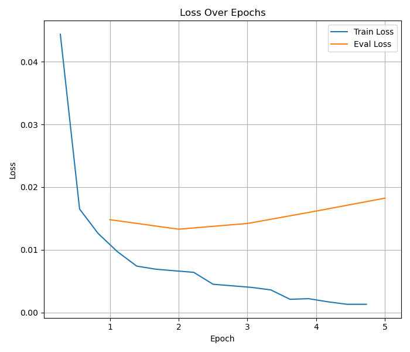
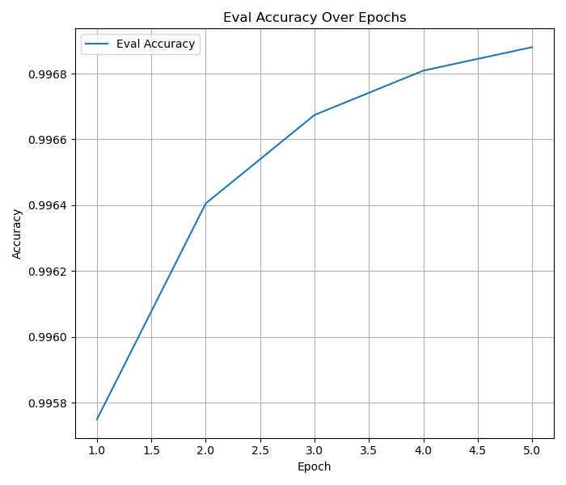

# 基于 Transformer 结构的序列标注模型和训练算法的文本说明

## a) 标注集(标签集)

序列标注的标签集是 `train_TAG.txt` 中的所有不同的标签组成的集合。通过自行编写的统计脚本（位于`utils/collect_tags.py`），我们得到了以下标签及其在训练文件中对应的数量：

- O: 17,182,664

- B_T: 180,819

- I_T: 494,698

- B_LOC: 206,640

- I_LOC: 326,891

- B_ORG: 15,081

- I_ORG: 33,203

- B_PER: 182,664

- I_PER: 352,243

  共**9**种标签类型。

## b) 模型和执行细节

### 模型结构

本次实验中，我们首先选择了 BERT 作为基础的预训练 Transformer 模型进行命名实体识别任务。具体的模型参数如下：

- 模型：[google_bert/bert-base-chinese](https://huggingface.co/google-bert/bert-base-chinese)
- 编码器层数/堆叠层数：12
- 每层隐藏单元数：768
- 自注意力头数：12
- 最大输入 token 数：512

> 注意：由于原始的BERT模型是在英文语料上进行训练的，几乎没有对于中文的支持，因此我们如果想要在中文语料上进行NER任务，需要选用在中文语料上进行预训练的BERT模型，如bert-base-chinese。

### 字向量

在本次实验中，我们选择使用预训练的 BERT 模型来初始化字向量。BERT 模型已经在大规模的文本数据上进行了预训练，学习到了丰富的语言表示能力。这些预训练的字向量可以作为很好的初始化，有助于提升模型的性能和加速训练过程。

- 字向量维数：768 （也就是隐藏层的单元数）

> ### 思考
>
> 在任务要求中提到：
>
> *Transformer 的层数等超参数自选，字向量可以随机初始化后训练，也可以采用已有开放词向量作为初始值，维度自选。是否采用类 CRF 模块建模序列关联可选。*
>
> 然而，从实际应用的角度出发，前人的多次实验证明，以 BERT 为代表的单编码器模型已经可以达到非常优秀的效果。如果我们选择自定义 Transformer 层数并从头训练模型，而不是采用“预训练+微调”的通用范式，不仅仅是本次提供的数据无法满足从头训练的需求，而且还需要消耗大量的计算资源。
>
> #### 预训练模型的优势
>
> 1. **数据规模与质量**：预训练模型（如 BERT）是在大规模的通用语料上训练的，能够捕捉到丰富的语言特征和语义信息。而本次任务提供的数据集规模较小，难以支撑从头训练一个高质量的 Transformer 模型。
>
> 2. **计算资源**：从头训练一个 Transformer 模型需要大量的计算资源和时间。相比之下，使用预训练模型并进行微调能够显著减少计算开销，同时也能获得较好的性能。
>
> 3. **模型稳定性**：预训练模型已经过大量数据的训练，参数已经收敛并且稳定。如果进行参数随机初始化，更改模型结构或更改为其他开源的词向量，可能会导致模型训练不稳定，甚至出现异常行为。
>
> #### 字向量初始化
>
> 自定义字向量也可能不是一个好主意。在预训练模型中，字向量的表征是直接内嵌在模型内部参数中的。这些字向量已经过充分训练，能够很好地捕捉词语的语义和上下文关系。如果采用随机初始化的字向量，模型需要更多的训练时间来学习这些特征，可能导致性能下降。而采用已有的开放词向量如 GloVe，虽然也是预训练的，但由于其不包含上下文信息，与 Transformer 模型的预训练字向量相比，效果可能不佳。
>
> #### 实际应用中的最佳实践
>
> 因此，使用 Transformer 进行命名实体识别（NER）任务的核心应该是寻找合适的、优秀的预训练模型，并在 NER 数据集上进行微调来获得预期的结果。通过微调，模型能够在保持预训练模型优势的基础上，进一步适应具体的 NER 任务，从而达到最佳的性能。
>
> 另外，由计算资源限制（训练一个epoch要一个多小时），在本次实验中无法同时训练多个模型，因此直接选用了NER效果最好的也是最通用的BERT模型。

### 训练算法及超参数

所有的训练策略通过传递给`run_ner.py`的命令行参数决定，我们采用的策略是：

```bash
python3 run_ner.py \
  --model_name_or_path /data/zzy/Models/bert-base-chinese \
  --trust_remote_code \
  --use_custom_dataset \
  --dataset_script utils/ner_dataset.py \
  --output_dir output \
  --do_train \
  --do_eval \
  --do_predict \
  --per_device_train_batch_size 64 \
  --per_device_eval_batch_size 64 \
  --eval_strategy "epoch" \
  --save_strategy "epoch" \
  --fp16 \
  --optim "adamw_torch" \
  --logging_steps 500 \
  --num_train_epochs 5 \
  --learning_rate 5e-5 \
  --lr_scheduler_type "linear" \
  --warmup_ratio 0.0 \
  --overwrite_output_dir
```

即：

- 优化器：AdamW *（Hugging Face Trainer的默认优化器，同时也是综合表现最好的）*
- 学习率：5e-5
- 学习率调度策略：线性衰减
- 训练批次大小：64
- 评估批次大小：64 *（Batch size的大小需要根据训练机器的GPU内存决定，我们使用两张NVIDIA RTX A6000进行训练，单卡有48GB显存，因此可以设置较大的BS）*
- 训练轮数：5  *（训练的轮次增多可以有效观察模型的表现变化）*
- Warmup 比例：0.0
- FP16 训练：开启

### 数据集预处理

我们使用 Hugging Face 提供的 `datasets` 库定义并加载了自定义的数据集，加载数据集的 Python 脚本位于 `utils/ner_dataset.py`。具体数据预处理步骤如下：

我们只需要定义数据集类 `CustomNERDataset`：

- 在 `_info` 方法中定义数据集的基本信息，如 `tokens`, `ner_tags` 和 `id`。

- 在 `_split_generators` 方法中定义数据集的划分，如 `train`, `validation` 和 `test` 数据集。

- 实现 `_generate_examples` 方法，逐行读取数据文件，将每一行文本和对应的标签分割成 token 和标签序列，并确保 token 和标签序列长度一致，生成包含 `tokens` 和 `ner_tags` 的字典。

在定义好数据集加载类脚本后，我们只需要将其作为参数传入`run_ner.py`即可实现自定义数据集的加载。

### 训练过程

我们基本采用了来自 Hugging Face Transformers 库的[示例脚本](https://github.com/huggingface/transformers/tree/main/examples/pytorch/token-classification)，并针对本次任务进行了特定的修改。以下是训练一个命名实体识别（NER）模型的详细流程：

1. **设置随机种子以保证结果的可复现性**

   为了确保实验结果的可复现性，我们在训练开始之前设置了随机种子。这样可以确保每次运行的结果一致，有利于调试和比较不同模型的性能。

2. **加载并预处理训练集、验证集和测试集**

   使用 Hugging Face 的 `datasets` 库加载并预处理数据集。数据集包括训练集、验证集和测试集。我们自定义了 `CustomNERDataset` 类来处理数据集的加载和预处理，具体步骤如下：

   ```python
   raw_datasets = load_dataset(data_args.dataset_script, trust_remote_code=True)
   ```

3. **确定数据集的列和标签**

   确定输入文本和标签所在的数据列。默认情况下，输入文本列名为 `tokens`，标签列名为 `ner_tags`。

   ```python
   if training_args.do_train:
       column_names = raw_datasets["train"].column_names
       features = raw_datasets["train"].features
   else:
       column_names = raw_datasets["validation"].column_names
       features = raw_datasets["validation"].features
   
   if data_args.text_column_name is not None:
       text_column_name = data_args.text_column_name
   elif "tokens" in column_names:
       text_column_name = "tokens"
   else:
       text_column_name = column_names[0]
   
   if data_args.label_column_name is not None:
       label_column_name = data_args.label_column_name
   elif f"{data_args.task_name}_tags" in column_names:
       label_column_name = f"{data_args.task_name}_tags"
   else:
       label_column_name = column_names[1]
   ```

4. **处理标签**

   如果标签是 `ClassLabel` 类型，则直接使用标签索引（**这个是我们的情况**）；否则，需要手动获取标签列表并生成标签到索引的映射。

5. **加载预训练模型和分词器**

   从 Hugging Face 模型库中加载预训练模型和分词器，配置模型以适应当前任务的标签数量。

6. **初始化数据 collator 以进行批量数据处理**

   使用 `DataCollatorForTokenClassification` 进行批量数据处理。数据 collator 用于在批处理中对数据进行适当的填充和对齐，以确保每个批次的数据具有相同的长度。

   ```python
   data_collator = DataCollatorForTokenClassification(tokenizer, pad_to_multiple_of=8 if training_args.fp16 else None)
   ```

7. **定义评估指标**

   使用 `seqeval` 库计算精确度、召回率和 F1 值。`seqeval` 是一个常用的评估序列标注任务的工具，能够计算每个实体级别的精确度、召回率和 F1 值。

   ```python
   metric = evaluate.load("utils/seqeval.py", cache_dir=model_args.cache_dir)
   
   def compute_metrics(p):
       predictions, labels = p
       predictions = np.argmax(predictions, axis=2)
   
       # Remove ignored index (special tokens)
       true_predictions = [
           [label_list[p] for (p, l) in zip(prediction, label) if l != -100]
           for prediction, label in zip(predictions, labels)
       ]
       true_labels = [
           [label_list[l] for (p, l) in zip(prediction, label) if l != -100]
           for prediction, label in zip(predictions, labels)
       ]
   
       results = metric.compute(predictions=true_predictions, references=true_labels)
       if data_args.return_entity_level_metrics:
           # Unpack nested dictionaries
           final_results = {}
           for key, value in results.items():
               if isinstance(value, dict):
                   for n, v in value.items():
                       final_results[f"{key}_{n}"] = v
               else:
                   final_results[key] = value
           return final_results
       else:
           return {
               "precision": results["overall_precision"],
               "recall": results["overall_recall"],
               "f1": results["overall_f1"],
               "accuracy": results["overall_accuracy"],
           }
   ```

8. **训练集和验证集的预处理**

   使用 `map` 函数对训练集和验证集进行预处理，包括 token 化和标签对齐。

   ```python
   if training_args.do_train:
       if "train" not in raw_datasets:
           raise ValueError("--do_train requires a train dataset")
       train_dataset = raw_datasets["train"]
       if data_args.max_train_samples is not None:
           max_train_samples = min(len(train_dataset), data_args.max_train_samples)
           train_dataset = train_dataset.select(range(max_train_samples))
       with training_args.main_process_first(desc="train dataset map pre-processing"):
           train_dataset = train_dataset.map(
               tokenize_and_align_labels,
               batched=True,
               num_proc=data_args.preprocessing_num_workers,
               load_from_cache_file=not data_args.overwrite_cache,
               desc="Running tokenizer on train dataset",
           )
   
   if training_args.do_eval:
       if "validation" not in raw_datasets:
           raise ValueError("--do_eval requires a validation dataset")
       eval_dataset = raw_datasets["validation"]
       if data_args.max_eval_samples is not None:
           max_eval_samples = min(len(eval_dataset), data_args.max_eval_samples)
           eval_dataset = eval_dataset.select(range(max_eval_samples))
       with training_args.main_process_first(desc="validation dataset map pre-processing"):
           eval_dataset = eval_dataset.map(
               tokenize_and_align_labels,
               batched=True,
               num_proc=data_args.preprocessing_num_workers,
               load_from_cache_file=not data_args.overwrite_cache,
               desc="Running tokenizer on validation dataset",
           )
   ```

9. **初始化 `Trainer` 并进行训练**

   使用 `Trainer` 类进行模型训练、评估和测试。`Trainer` 是 Hugging Face 提供的一个高级 API，简化了训练、评估和预测的流程。

   ```python
   trainer = Trainer(
       model=model,
       args=training_args,
       train_dataset=train_dataset if training_args.do_train else None,
       eval_dataset=eval_dataset if training_args.do_eval else None,
       tokenizer=tokenizer,
       data_collator=data_collator,
       compute_metrics=compute_metrics,
   )
   
   # Training
   if training_args.do_train:
       checkpoint = None
       if training_args.resume_from_checkpoint is not None:
           checkpoint = training_args.resume_from_checkpoint
       elif last_checkpoint is not None:
           checkpoint = last_checkpoint
       train_result = trainer.train(resume_from_checkpoint=checkpoint)
       metrics = train_result.metrics
       trainer.save_model()  # Saves the tokenizer too for easy upload
   
       max_train_samples = (
           data_args.max_train_samples if data_args.max_train_samples is not None else len(train_dataset)
       )
       metrics["train_samples"] = min(max_train_samples, len(train_dataset))
   
       trainer.log_metrics("train", metrics)
       trainer.save_metrics("train", metrics)
       trainer.save_state()
   ```

通过以上步骤，我们成功地训练了一个基于 Transformer 的命名实体识别模型，并对其进行了评估和测试。该模型能够有效地识别文本中的命名实体，为后续任务提供了可靠的基础。

## c) 训练损失和发展集性能随时间变化的曲线

每一轮记录训练损失，同时在发展集上进行测试，获得其标注性能（准确率）。以下为训练过程中训练损失和发展集性能的变化情况：




通过观察曲线，我们选择在第 5 轮次时的模型进行测试，该轮次的训练损失最低，且在发展集上的表现最好。

## d) 参考文献、网页和代码

1. Devlin, J., Chang, M. W., Lee, K., & Toutanova, K. (2019). BERT: Pre-training of Deep Bidirectional Transformers for Language Understanding. arXiv preprint arXiv:1810.04805.
2. Hugging Face Transformers Task Guides: https://huggingface.co/docs/transformers/tasks/token_classification
3. Hugging Face Datasets: dataset loading script: https://huggingface.co/docs/datasets/main/en/dataset_script
4. Hugging Face Transformers Example Scripts: https://github.com/huggingface/transformers/tree/main/examples/pytorch/token-classification

## 说明

本次作业使用了大模型辅助，主要辅助了实验报告的编写（约60%是大模型生成内容，经过了细致的人工审核），而实验代码编写则很少（<10%）使用大模型辅助。

本次实验我的主要工作为：

1. 对于Hugging Face GitHub仓库提供的示例脚本`run_ner.py`和`run.sh`进行了透彻的理解，并且针对本次任务进行了适当修改（**重点**）；
2. 编写了自定义数据集加载脚本`utils/ner_dataset.py`；
3. 编写了Named Entity标签统计脚本`utils/collect_tags.py`；
4. 编写了检查点模型推理脚本`predict.py`；
5. 编写了训练loss和acc可视化脚本`utils/plot.py`
6. 撰写了详细的模型和训练算法文本说明，并提出了自己的思考。